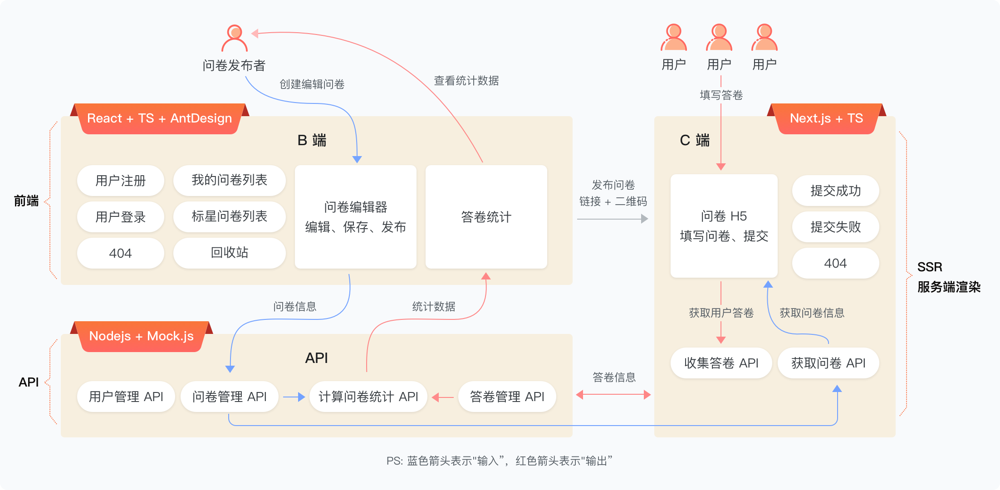
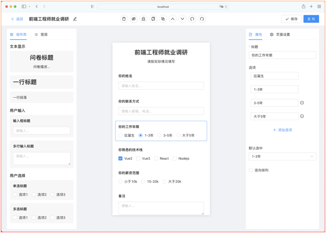

# questionnaireInvestigation
一款问卷调查覆盖,前端,后端,B端,C端

## 项目启动

1. 首先找到mock-data目录

2. 然后终端打开,执行npm run dev 启动mock的服务端数据

3. 找到 question-demo目录

4. 终端执行 如下命令

   ```bash
   npm  install 安装依赖
   npm  start  启动项目
   ```

   

## 项目简介图示



### PC效果



### H5-UI图


