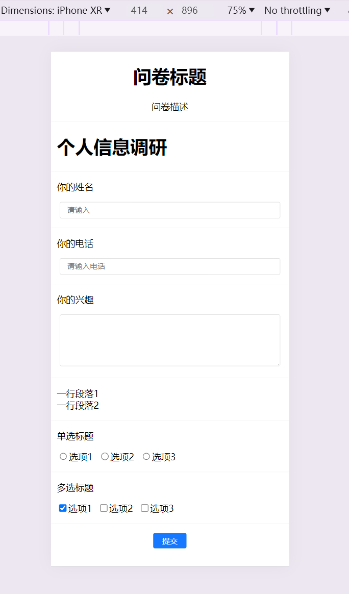

# questionnaireInvestigation
## 线上地址

- [问卷调查低代码](http://120.26.197.151/)

## 介绍

- 一款关于低代码的问卷调查，覆盖B端,C端

- 使用技术栈是React+Antd+Typescript+ahooks+Next14+Nest.js

## 项目启动

1. 首先找到mock-data目录

2. 然后终端打开,执行npm run dev 启动mock的服务端数据

3. 找到 question-demo目录

4. 终端执行 如下命令

   ```bash
   npm  install 安装依赖
   npm  start  启动项目
   ```

   

## 项目架构


## 效果演示

### 主页


### H5效果演示


